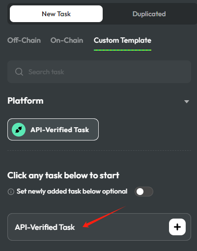
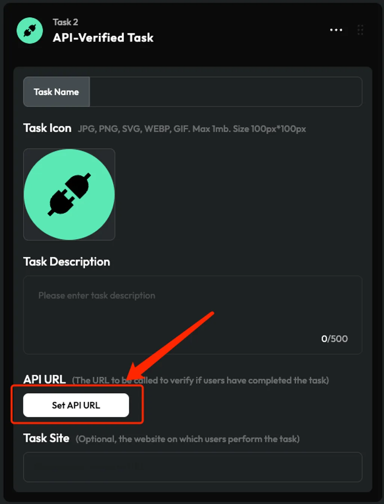
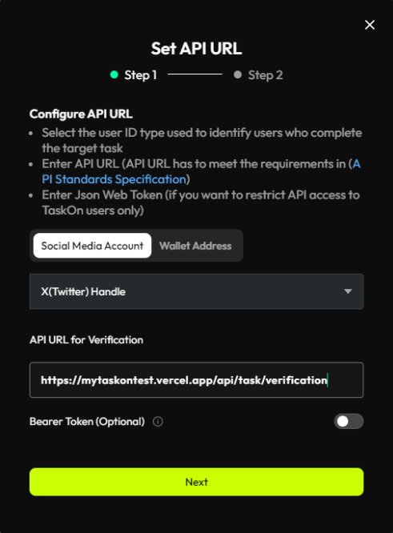
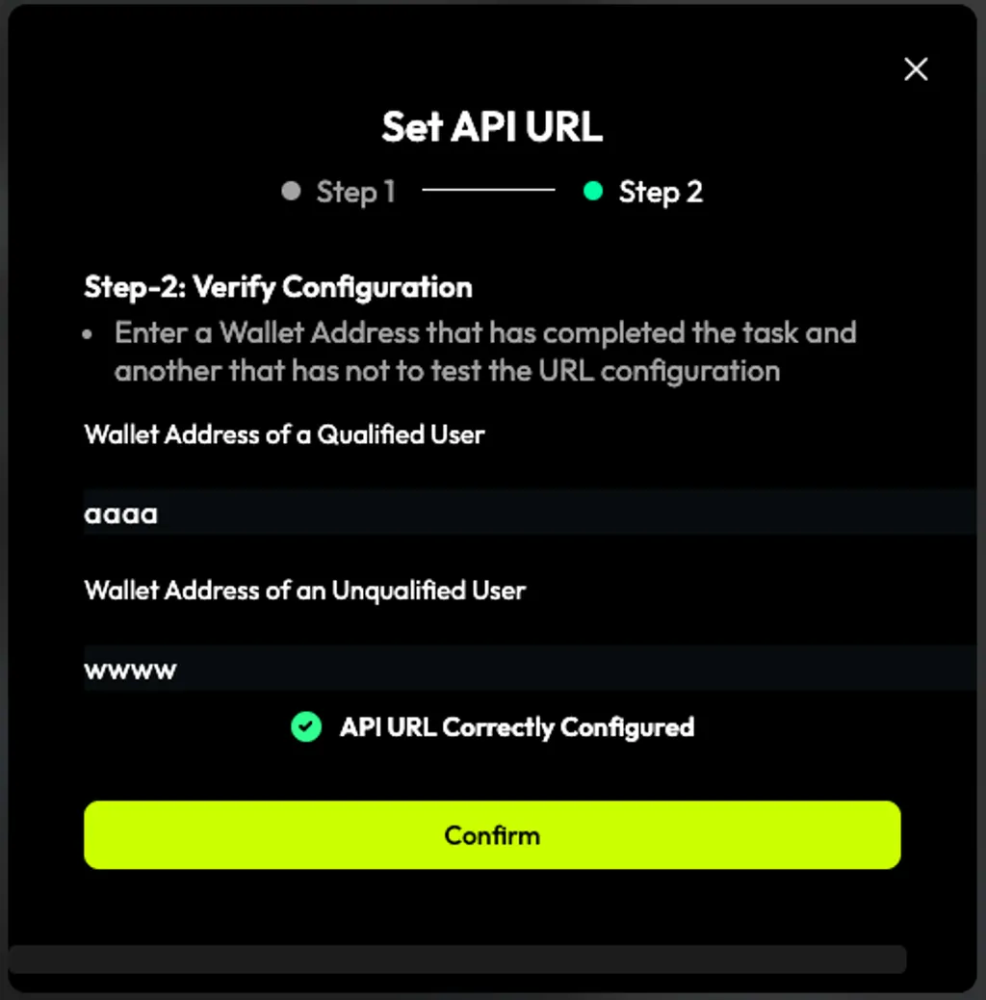

# TaskOn Verification API Demo

This repository provides a demo implementation of the TaskOn Verification API. It serves as a reference for implementing your own verification service that integrates with TaskOn.

[](https://vercel.com/new/clone?repository-url=https%3A%2F%2Fgithub.com%2Ftaskon-xyz%2Ftaskon-verification-demo)

## Features

- FastAPI-based verification endpoint
- OpenAPI/Swagger documentation
- One-click Vercel deployment
- Demo implementation of task verification logic

## API Documentation

### Verification Endpoint

- **URL**: `/api/task/verification`
- **Method**: GET
- **Query Parameters**: 
  - `address`: Wallet address or social media ID (case-insensitive)
- **Optional Headers**:
  - `Authorization`: Bearer token (if enabled)

#### Response Format

```json
{
    "result": {
        "isValid": true|false
    }
}
```

## Local Development

1. Install dependencies:
   ```
   pip install -r requirements.txt
   ```

2. Run the development server:
   ```
   uvicorn api.index:app --reload
   ```

3. Access the API documentation:
   - Swagger UI: http://localhost:8000/docs
   - ReDoc: http://localhost:8000/redoc

## Deployment

1. Click the "Deploy with Vercel" button above
2. Follow the Vercel deployment process
3. Your API will be available at your Vercel deployment URL

## Demo Implementation Details

The demo implementation includes:

- Sample verification logic
- Pre-configured test addresses
- Bearer token support
- Case-insensitive address handling

## Testing

Use the Swagger UI at `/docs` to test the API endpoints. The demo includes several pre-configured addresses for testing:

- Wallet address: `0xd5045deea369d64ab7efab41ad18b82eeabcdefg`
- Twitter handle: `taskonxyz`
- Discord ID: `1084460817220641111`
- Telegram ID: `6881505111`
- Email: `demo@taskon.xyz`

## 5. How to Set API Task

<div style="display: flex; gap: 20px; margin-bottom: 30px;">
  <div style="flex: 1;">
    <h3>1. Slect API Task</h3>
    - Go to the TaskOn dashboard and click on the "API Task" tab.<br/>
    - Click on the "Create API Task" button.
    <br clear="left" />
    
  </div>

  <div style="flex: 1;">
    <h3>2. Fill in the Details</h3>
    - Complete all required fields & Upload the task icon.<br/>
    - Click on the "Set API URL" button.
    <br clear="left" />
    
  </div>
</div>

<div style="display: flex; gap: 20px; margin-bottom: 30px;">
  <div style="flex: 1;">
    <h3>3. Fill the api url</h3>
    - URL: If you use this repo and vercel, it shoud be like this: `https://xxx.vercel.app/api/task/verification`<br/>
    - [Optional] Bearer Token: Enable this to restrict API access to TaskOn only.
    <br clear="left" />
    
  </div>

  <div style="flex: 1;">
    <h3>4. Verify Configuration & Confirm Your Settings</h3>
    - **Purpose:** Ensure everything works smoothly.<br/>
    - **Provide:**<br/>
        1. User ID of a task completer<br/>
        2. User ID of a non-completer<br/>
    - Think of it as a "**hero**" vs "**zero**" scenario.<br/>
    - After verification, give it a thumbs up!
    <br clear="left" />
    
  </div>
</div>

## Support

For questions or support, please refer to the TaskOn documentation or contact the TaskOn team.
